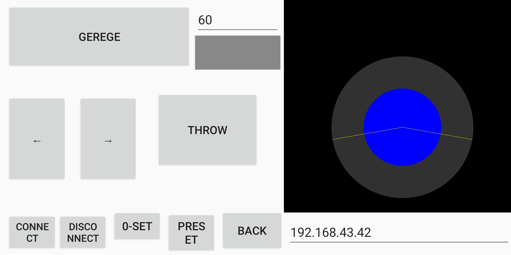

# Swerve Controller

This is an Android app to control a PICT robocon 2019 robot(MR1)

## Screen

## Features

- Supports Android 9 or higher
- Uses mobile's Wi-Fi to send instructions to esp8266 module
- It has a joystick widget that helps to get an angle and PWM output for vehicle motion
- Supports setting the IP address of the receptor module
- It has a bunch of configurable buttons to update functionality on runtime.

